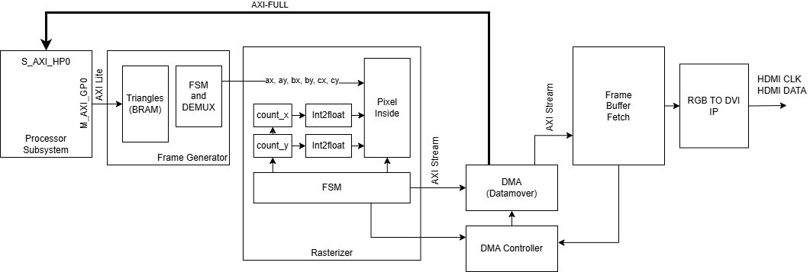

# Introduction
I've always been fascinated by how GPUs take a list of triangles and turn them into the images we see on screen — all in real time. From vertex shaders to rasterization to fragment processing, the graphics pipeline is a marvel of parallel, high-throughput hardware design. But while reading about it is informative, I believe there's no better way to truly understand a system than by building it from scratch.

So, I set out on a personal journey: to implement each stage of the graphics pipeline in hardware, using SystemVerilog on an FPGA. My goal is to explore how concepts like rasterization, interpolation, and framebuffers work at the signal level — and to build something that actually displays on a real monitor.

This blog is the first step in that journey. The objective?
Draw triangles on an HDMI monitor, given a list of triangles in floating point coordinates.

Sounds simple — but it turns out there's a lot to unpack just to get to that first pixel!

# Platform and System Setup
To bring this project to life, I used the Digilent Zybo Z7-20 FPGA board, which features a Xilinx Zynq-7000 SoC. This board is ideal because it includes both:

- a programmable logic (PL) fabric (i.e., the FPGA), and

- an on-board ARM processor (PS) subsystem with access to DDR3 memory and standard AXI interfaces.

My goal is to store the frame buffer in DDR memory and display it via HDMI, using the processor subsystem to coordinate the DDR memory access and control.

Here's the basic system architecture I implemented:

The processor subsystem (PS side) has the DDR3 controller and exposes memory access to the PL via High Performace AXI port which the programmable lgoic can use to read/write the frame buffer to the DDR using AXI 4 protocol.

On boot, the processor write both a list of triangles (floating point vertex coordinates) an enable bit via an AXI-Lite control port.

Once enabled, the PL logic:

- Reads triangle vertex data from on-chip BRAM memory

- Rasterizes each triangle into pixel values (initially always a full white pixel if inside the triangle)

- Writes the results into one of two frame buffers stored in DDR memory.

Meanwhile, the active frame buffer is continuously read from DDR and the pixel data is streamed to the HDMI controller for display.

# Block Diagram
The figure below shows the overall architecture I used to rasterize and display triangles via HDMI. The system is divided into several key components, most of which were implemented from scratch in RTL using SystemVerilog.

Let’s go through each part of the pipeline:

## Processor Subsystem (Zynq PS)
The ARM processor handles system orchestration. It:

Loads triangle vertex data (in floating point format) into memory,

Sends a draw request by writing to an AXI-Lite control register,

Grants access to DDR memory via the S\_AXI\_HP0 high-performance AXI port.

For this project the processor subsystem needed to be configued to have one High Performance AXI slave for the DDR access and one General Purpose AXI port for sending the list of triangles and initiaing the draw call.

## Frame Generator
Implemented in RTL, this block:

Reads each triangle data from a small on-chip BRAM buffer,

Breaks it into individual vertex groups (A, B, C),

Sends them to the rasterizer one triangle at a time and loads the next triangle when the current one is finished rasterizing;

## Rasterizer
The heart of the system. This module:

Iterates over screen-space pixels using count\_x and count\_y,

Converts pixel coordinates to floating-point,

Evaluates whether each pixel lies inside the triangle using edge functions or barycentric logic,

If a pixel is inside, it writes a constant white color value into the frame buffer using AXI.

This block fully rasterizes each triangle into a memory-mapped frame buffer region.

## DMA Controller + Xilinx Datamover
Because the rasterizer writes to and the HDMI engine reads from DDR memory, I needed a memory controller:
The rasterizer sends the list of pixels using AXI stream protocol. To send it to the correct location in memeory, I decided to use the Xilinx Datamover IP.

I implemented the DMA controller block to send s2mm and mm2s commands to the datamover block.

The Datamover translates internal DMA requests into high-performance AXI reads/writes for efficient memory throughput.

## Frame Buffer Fetch
This RTL block continuously:

Reads pixel data from the active frame buffer,

Outputs a pixel stream to the video pipeline,

Synchronizes with video timing signals to ensure clean display.

The system is double-buffered: while one buffer is being written to by the rasterizer, the other "active" one is being read from bt this block.

# Pixel Inside Triangle check
To determine whether a pixel lies inside a given triangle, I used a classic edge function technique described in this excellent triangle rasterization tutorial. The idea is to compute three scalar values — one for each edge of the triangle — and check that they all have the same sign. If they do, the pixel is inside.

The three expressions are:

s1 = (bx - ax)(py - ay) - (by - ay)(px - ax)
s2 = (cx - bx)(py - by) - (cy - by)(px - bx)
s3 = (ax - cx)(py - cy) - (ay - cy)(px - cx)

Each expression is of the form:
(p1 - p2) * (p3 - p4)

And I needed to evaluate six such terms per pixel. To keep the implementation simple and pipelined, I designed a dedicated hardware block to evaluate this logic in six steps.

## Inside-Check Architecture
Here is a schematic of my inside\_check logic:

This block receives the pixel coordinates (px, py) and the triangle vertices (ax, ay, bx, by, cx, cy), then evaluates each term of the edge equations one-by-one. 

A small FSM sets the inputs to multiplexers labeled i1, i2, i3, and i4 to select the correct terms at each stage.

## Execution Steps (FSM)
The FSM cycles through 6 steps to evaluate the three s values:

Evaluate first term of s1
i1 = bx, i2 = ax, i3 = py, i4 = ay
latch\_mult = 1

Evaluate second term of s1 and check sign
i1 = by, i2 = ay, i3 = px, i4 = ax
latch\_mult = 0
→ If sgn\_out == 0, terminate early (pixel is outside)

Evaluate first term of s2
i1 = cx, i2 = bx, i3 = py, i4 = by
latch\_mult = 1

Evaluate second term of s2 and check sign
i1 = cy, i2 = by, i3 = px, i4 = bx
latch\_mult = 0
→ If sgn\_out == 0, terminate early

Evaluate first term of s3
i1 = ax, i2 = cx, i3 = py, i4 = cy
latch\_mult = 1

Evaluate second term of s3 and check sign
i1 = ay, i2 = cy, i3 = px, i4 = cx
latch\_mult = 0
→ If sgn\_out == 0, terminate early

## Floating Point Arithmatic
To support floating point coordinate calculations during the inside check, I reused components from a custom Verilog-based floating point arithmetic library vailable here.

## Performance
If the pixel is inside the triangle, it takes 6 clock cycles to verify.
If any edge check fails early, it takes 2 or 4 cycles, saving time.

This dedicated module helps the rasterizer evaluate pixel coverage quickly and efficiently in hardware.

# Results
This photo shows drawing of two triangles. 

These are the vertext coordinates for the traingles

Triangle 1 - (0, 64), (

t looks blurry because the this is a 640x480 image on a 4k monitor.

# Coming Soon
The next step is to make the triangles move to make sure that the dobule buffering system is working properly.

After that I plan to implment interpolation with different color values for the vertexes so that we can render a shaded 3d model. 

I plan to publish the vivado and vitis project files soon too.
